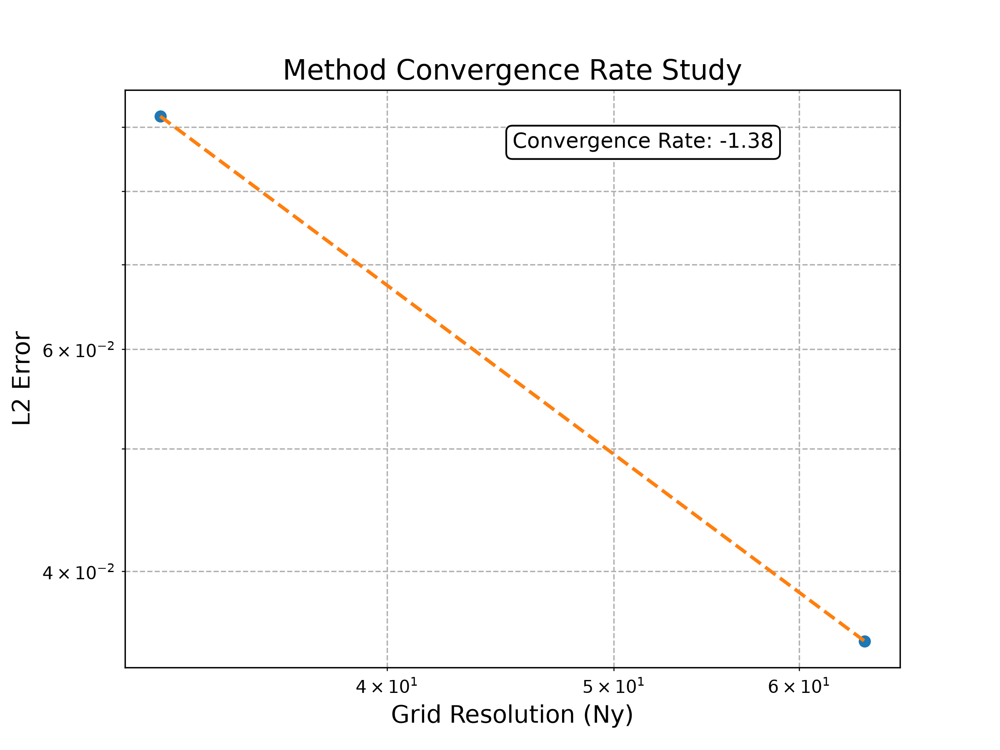
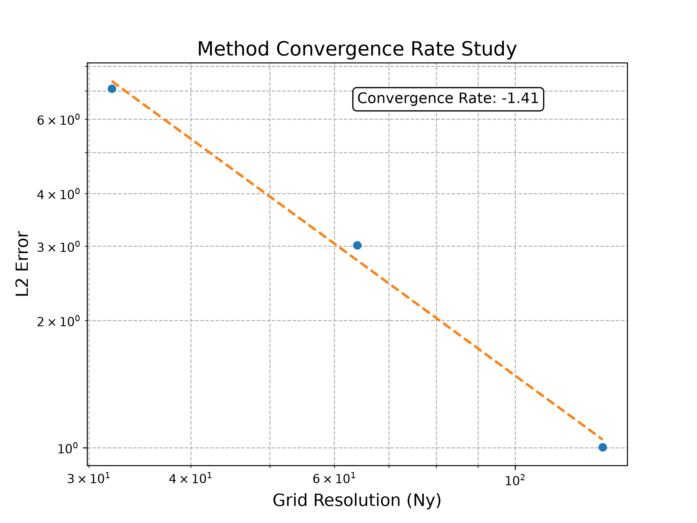
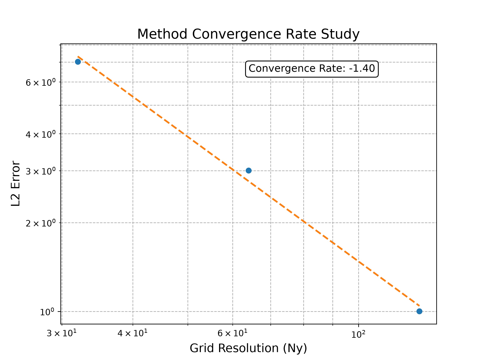

<p align="center">
  
</p>

# 2D Lattice Boltzmann Solver

A D2Q9 lattice Boltzmann implementation in Python with Numba-accelerated kernels.
Verified analytically against Poiseuille flow (two driving mechanisms) and numerically
via grid-convergence studies on three obstacle geometries.

URSS summer project, University of Warwick, supervised by Dr. Radu Cimpeanu.
Foundation for follow-on topology-optimisation work.

**Architecture:** `BaseLattice` engine with case-specific subclasses. Reynolds number is
prescribed and lattice velocity derived, so all resolutions in a convergence study
simulate the same physical flow.

---

## Contents

**Analytical verification**
[1.1](#force) Force-driven Poiseuille · [1.2](#pressure) Pressure-driven Poiseuille · [1.3](#erroranalysis) Error decomposition · [1.4](#minres) Minimum resolution

**Numerical verification**
[2.1](#gridsetup) Method · [2.2](#tworect) Two rectangles · [2.3](#step) Backward step · [2.4](#cyl) Cylinder · [2.5](#gridsum) Summary

---

# 1. Analytical Verification

<a name="force"></a>
## 1.1 Force-driven periodic channel

<p align="center">
  
</p>

<p align="center">
  
  
</p>

Uniform body force everywhere, periodic in the flow direction. Cleanest test — the flow
is translationally invariant, so a short domain suffices and the analytical parabola is
representable exactly on the lattice.

- Driver: `g_x = 8·ν·u_max / H_eff²`, `H_eff = Ny − 2`
- τ = 0.933 places bounce-back wall exactly at `y = 0.5`
- **Residual ~1e-8, convergence essentially second-order** (limited by iteration tolerance, not physics)

<a name="pressure"></a>
## 1.2 Pressure-driven channel

<p align="center">
  
</p>

<p align="center">
  
  
</p>

Density difference imposed via Zou-He BCs at inlet/outlet; half-way bounce-back at walls;
non-periodic in x. `p = ρ/3` in LBM.

- Driver: `Δρ = 24·ν·L·u_max / H_eff²`, symmetric split around ρ = 1
- Same target `u_max` as force-driven → cases directly comparable
- **Residuals 1e-4 to 1e-5** — larger due to open BCs and density variation
- Transient: acoustic waves from both ends, reflect and damp

**Equivalence.** Body force `g_x` and pressure gradient `−∂p/∂x` enter momentum identically.
Both target `u(y) = (driver/2ν)·y·(H−y)`. Error difference reflects numerics of the
driving mechanism, not different flows.

<a name="erroranalysis"></a>
## 1.3 Error decomposition (pressure case)

<p align="center">
  
  
</p>
<p align="center">
  
  
</p>

Residual changes sign as Ny grows — two competing sources:

| Source | Sign | Scaling | Origin |
|---|---|---|---|
| Compressibility | + | ~1/Ny² | ρ varies along channel; velocity samples at lower ρ inflated |
| Wall slip | − | ~1/Ny | Residual bounce-back slip at fixed τ |

Convergence transitions from ~−2 (compressibility-limited, low Ny) to ~−1 (slip-limited,
high Ny). Fitting to the compressibility regime alone recovers second-order.

<a name="minres"></a>
## 1.4 Minimum sensible resolution

Studies start at Ny = 16; below Ny = 8 is outside the method's validity envelope.

- **Knudsen:** `Kn ~ c_s·τ/Ny`; Chapman–Enskog needs Kn ≪ 1
- **Profile resolution:** ≥16 cells for a decent parabolic fit
- **Wall placement:** bounce-back offset ~1/Ny (25% at Ny=4, 1.5% at Ny=64)

---

# 2. Numerical Verification

Where no analytical solution exists, verify **resolution independence**: grid-convergence
studies on three obstacle geometries against the highest-resolution reference.

<a name="gridsetup"></a>
## 2.1 Method

- **Resolutions:** Ny ∈ {32, 64, 128, 256}; Ny = 256 as reference
- **Metric:** relative L2 of velocity magnitude, non-dimensionalised by each case's `u_max`, over cells fluid in *both* the reference and the upsampled coarse
- **Upsampling:** nearest-neighbour block expansion
- **Re held fixed across resolutions:** `u_max = Re·ν/L_char` recomputed per resolution — otherwise different resolutions simulate physically different flows
- **Re = 10** throughout: laminar, subcritical for cylinder (shedding threshold ~46), steady
- **BCs:** Zou-He velocity inlet (west), zero-gradient outflow (east), half-way bounce-back on all solids

Reynolds convention per case:

| Case | `L_char` | Basis |
|---|---|---|
| Two rectangles | Channel height (Ny − 2) | Peak inlet velocity |
| Backward step | Inlet height (upper channel) | Armaly et al. 1983 |
| Cylinder | Diameter | Turek benchmark |

<a name="tworect"></a>
## 2.2 Two staggered rectangles

<p align="center">
  
</p>

<p align="center">
  
</p>

Half-height blocks on opposing walls, staggered in x. Flow snakes through constricted gaps.
**All boundaries grid-aligned — no staircase error.**

- L2 at Ny=32: **9.6e-2** · Ny=64: **3.6e-2** · slope **≈ −1.4** *(fill in final)*

<a name="step"></a>
## 2.3 Backward-facing step

<p align="center">
  
</p>

<p align="center">
  
</p>

Step in the lower inlet quarter. Flow enters upper half, separates at the corner, forms a
recirculation bubble. Inlet prescribed on fluid rows only; obstacle mask handles the rest.

- L2 at Ny=32: *(fill in)* · slope *(fill in)*

<a name="cyl"></a>
## 2.4 Cylinder

<p align="center">
  
</p>

<p align="center">
  
</p>

Diameter = 0.2·channel height, offset below centre (Turek convention). **Staircase
approximation limits convergence to first order** regardless of interior LBM accuracy.
IBB would recover second order; out of scope here.

- L2 at Ny=32: *(fill in)* · slope *(fill in, expected ~−1)*

<a name="gridsum"></a>
## 2.5 Summary

| Case | Slope | Limiter |
|---|---|---|
| Two rectangles | *fill in* | Interior LBM + wall slip |
| Backward step | *fill in* | Corner separation singularity |
| Cylinder | *fill in* | Staircase boundary (O(Δx)) |

Expected ranking by clean order: two-rectangles > backward-step > cylinder. Observed
ordering *(matches / differs)* — see plots.

---

## Reproducing

```bash
pip install -e .
python main_analytical.py    # §1
python main_numerical.py     # §2
```

Figures regenerate into `results/plots/{case}/` and `results/animations/{case}/`.
Ny = 256 reference runs take hours per case on single CPU; smaller Ny in minutes.

## References

- Krüger et al., *The Lattice Boltzmann Method*, Springer 2017
- Zou & He, *Phys. Fluids* 9(6), 1997 — Zou-He BCs
- Guo, Zheng, Shi, *Phys. Rev. E* 65(4), 2002 — Guo forcing
- Armaly et al., *J. Fluid Mech.* 127, 1983 — backward-step benchmark
- Schäfer & Turek, 1996 — cylinder benchmark