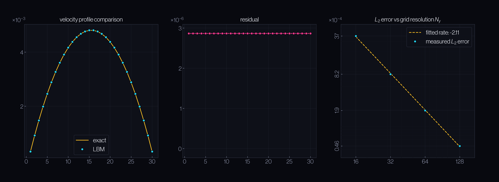
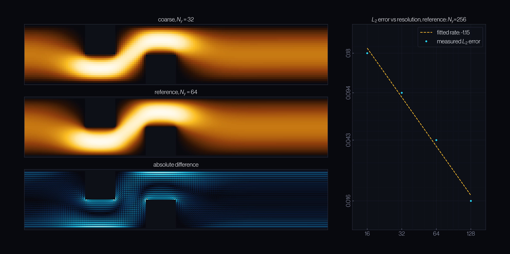
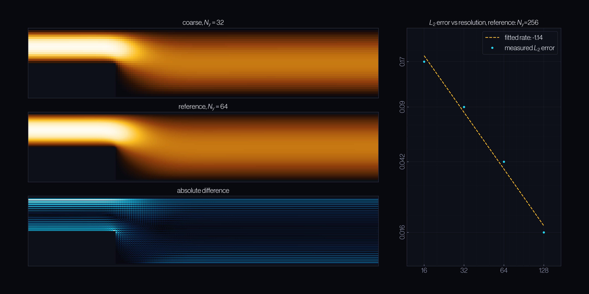
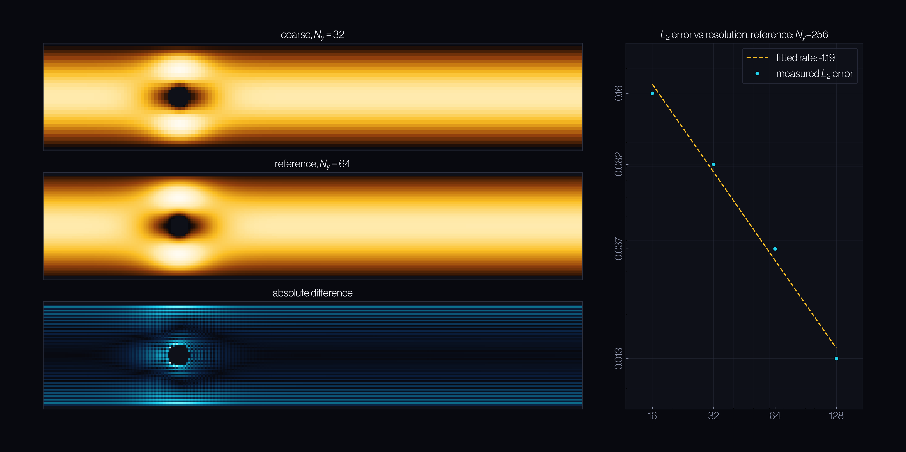

  

# 2D Lattice Boltzmann Solver

A D2Q9 lattice Boltzmann implementation in Python with Numba-accelerated kernels.
Verified analytically against Poiseuille flow and numerically via grid-convergence studies on three obstacle geometries.

URSS summer project, University of Warwick, supervised by Dr. Radu Cimpeanu.
Foundation for follow-on topology-optimisation work documented in [`topopt-lbm-python`](https://github.com/r-i-p-dance/topopt-lbm-python).

---

## Contents

**Analytical verification**
[Force-driven periodic channel](#11-force-driven-periodic-channel)

**Numerical verification**
[2.1 Two staggered rectangles](#21-two-staggered-rectangles) ·
[2.2 Backward-facing step](#22-backward-facing-step) ·
[2.3 Cylinder](#23-cylinder)

---

# 1. Analytical Verification

## Force-driven periodic channel

  

  

We compared our simulated velocities to the exact solution for Poiseuille flow between two plates. The error falls fourfold every time the grid doubles — second-order convergence, the expected rate, confirming the implementation is correct.

**Method Stack**

D2Q9 LBM, BGK collision, half-way bounce-back walls, uniform body force at every cell, relaxation time tau set to 0.933 which places bounce-back wall exactly at the middle of the cell, minimum sensible vertical resolution set to 16 cells for method validity.

---

# 2. Numerical Verification

Most fluid-flow scenarios in realistic geometries have no exact solution, so we simulated three obstacle cases each at five resolutions and measured the error between coarse and fine grids.

**Method Stack**

Constant Re across resolutions, Poiseuille velocity inlet, Zou–He pressure outlet, error measured on the shared fluid cells only

## 2.1 Two staggered rectangles

  

  

The rate falls to −1.0. Two errors compete: the bulk flow is second-order accurate; the sharp corners, only first-order. At low Re the first-order term dominates.

## 2.2 Backward-facing step

  

  

## 2.3 Cylinder

  

  

---

## References

1. Krüger, T. et al. (2017) — *The Lattice Boltzmann Method: Principles and Practice.* Springer. [10.1007/978-3-319-44649-3](https://doi.org/10.1007/978-3-319-44649-3) — the method.
2. Zou, Q. & He, X. (1997) — On pressure and velocity boundary conditions for the lattice Boltzmann BGK model. *Physics of Fluids* 9(6). [10.1063/1.869307](https://doi.org/10.1063/1.869307) — the boundary conditions.
3. Guo, Z., Zheng, C. & Shi, B. (2002) — Discrete lattice effects on the forcing term in the lattice Boltzmann method. *Physical Review E* 65(4). [10.1103/PhysRevE.65.046308](https://doi.org/10.1103/PhysRevE.65.046308) — the forcing scheme.
4. Bhatnagar, P.L., Gross, E.P. & Krook, M. (1954) — A Model for Collision Processes in Gases. *Physical Review* 94(3). [10.1103/PhysRev.94.511](https://doi.org/10.1103/PhysRev.94.511) — the collision operator.
5. Armaly, B.F. et al. (1983) — Experimental and theoretical investigation of backward-facing step flow. *Journal of Fluid Mechanics* 127. [10.1017/S0022112083002839](https://doi.org/10.1017/S0022112083002839) — the backward-step benchmark.
6. Schäfer, M. & Turek, S. (1996) — Benchmark computations of laminar flow around a cylinder. In *Flow Simulation with High-Performance Computers II*, Vieweg. [10.1007/978-3-322-89849-4_39](https://doi.org/10.1007/978-3-322-89849-4_39) — the cylinder benchmark.